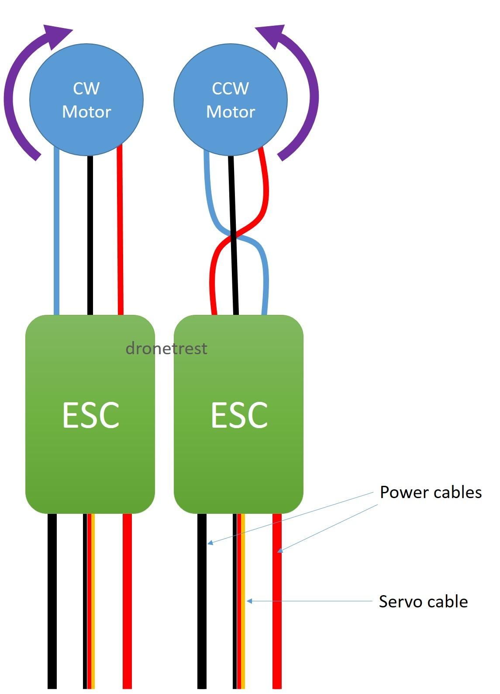
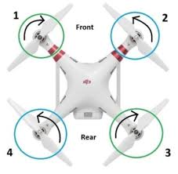
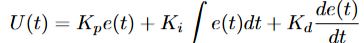
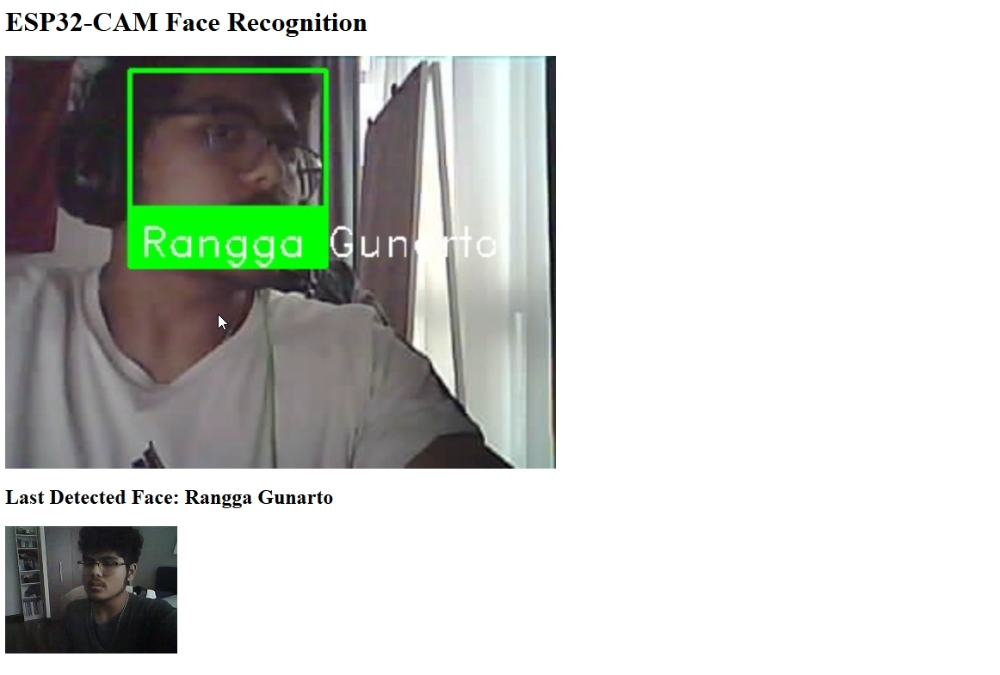

# ADSS-poc : A how to guide on making an autonomous drone.

## Overview
This guide serves as a simple framework for those who are interested in making a basic autonomous drone with a 6-axis PID balancing system, power delivery management and a general guide on creating your own drone. This guide is aimed at those who are **NOT** new to systems engineering or electrical engineering as understanding and replicating this guide requires an adequate understanding of Arduino and ESP32 platforms and wiring components.

In this guide, you will understand and possibly create your own autonomous drone system with a full Command-over-WiFi framework suite as well as a basic guide to creating, debugging and testing your drone.

### List of Materials
- Arduino Mega 2560 
    - You should choose a component with better processing power than the Arduino Mega 2560, I chose this at the time due to the sheer number of analogue and digital I/O pins.
- ESP32-CAM
    - It does not matter what type of ESP32-CAM you get, I personally chose the AIThinker version.
- ESP32
- x4 1000KV DC Brushless Motors
    - Be advised, a higher KV motor such as the 1200 or 1600KV would work much better, I chose the 1000KV due to budget and regional availability. 
- x4 30A ESC
- x4 iFlight NAZGUL 5 inch 5mm Prop Blades
- Matek 12V XT60 PDB
- XT60 Male/Female Connectors
- 11.1V 3S 25C 2600mAh LiPo Battery
- MPU6050 / MPU6090 for 9-axis PID
- QAV250 Drone Frame
- Breadboard 
    - Recommended to use a perfboard instead.

---
## Preperation of Materials
In most cases, the battery you will recieve will not have a Male XT60 plug connected to it. To fix this issue you will need to transplant the Male XT60 plug to the positive and negative terminals of the battery.

1. Prepare your battery and check for any damages during shipping
2. Using a **wirecutting** tool, cut off the wires from the existing connector **one at a time**. Do not cut both wires at once as it will cause a short and damage the battery
3. After cutting each wire, strip the ends of the wire and apply electrical tape to the exposed ends and repeat for the other terminal.
4. Apply solder and flux to the terminal of the XT60 connector, the flat end of the connector is for the postive terminal, and the beveled edge is for the negative terminal.
5. Solder your wires one at a time and wait for it to cool off.
6. Using a multimeter, check the connection of the XT60 and ensure a current is running

The QAV250 has two platforms, a bottom and a top platform. Attach the Matek PDB to the bottom platform and ensure that the XT60 Female terminals are able to be accessed, solder the XT60 female connector to the PDB. Once soldered to the PDB, connect the the battery to the female connector and check for a running current. The PDB has 12 terminals in total with an extra 4 for routing external power, attach the ESC's to the arms of the QAV250 (zipties will be sufficient) and attach the positive and negative wires to the respective terminals on the PDB. As a note, please invest in a good soldering iron with high quality solder, a mistake I made was using a heavily oxidized soldering iron which led to terrible solder connections, and an overall ugly look. 

The arms on the QAV250 is made to fit these motors, so simply screw them onto the frame tightly. Refer to this diagram to find the correct orientation for motor spin.



We will be using a quadcopter setup for this drone, so the orientations differ from each motor, refer to the diagram to assist you.



Once all the motors and ESC's are wired up to the drone and have been securely attached to the drone, screw in the top platform of the QAV250 and secure the Arduino Mega 2560 on the top platform, as well as attach the perfboard or breadboard. There is an anti-vibration platform which comes with the drone frame, but I did not make use of it in this project yet as it hindered the space I could have worked with. If you are able to keep the anti-vibration platform it would come in handy when working on the PID system.

Once the top platform is securely built, you can ziptie the battery onto the bottom of the frame, there is a small space at the bottom platform so it does not clash with the PDB and any wiring adjustments you'll want space for in the future. 

---

## Wiring
First thing to do, is sort out the power management with the rest of the components and with the main Arduino flight board. There are two power output pads on the PDB, 12V and 5V. Get jumper wires and solder the 12V GND and output and connect the power output to the Arduino Mega 2560 VIN pin, the negative terminal of the 12V output should go to the negative rail on the breadboard. Once this is done, connect the GND from the Arduino Mega 2560 to **BEFORE** the GND connection from the PDB on the breadboard. Then solder a jumper wire from the 5V output and GND to the other power rail of the breadboard, make sure to bridge the GND rail from both rails to ensure that any high-voltage components still can communicate with the Arduino, no matter what rail they are connected to. 

The next step is to connect the ESC's to the Arduino, the ESC has three servo wires which, the red wire can be ignored as the ESC is already powered by the PDB. The black wires should be connected to the high-power GND rail on the breadboard and the control wires should be connected in the following order:
- Front-Left ESC -> PIN_3
- Back-Left ESC -> PIN_5
- Front-Right ESC -> PIN_9
- Back-Right ESC -> PIN_6

Then, connect the MPU6050 to the breadboard and follow this wiring scheme:
- MPU6050 SDA -> Arduino SDA
- MPU6050 SCL -> Arduino SCL
- VCC -> High Power 5V Rail
- GND -> Any GND Rail

Next step is to connect the ESP32 responsible for the Command-over-WiFi system onto the drone, this component can be strapped or screwed in anywhere to the drone as long as the USB-Micro/C port can be accessed to upload and update the code for future changes or adjustments. 

- 5V -> High Power 5V Rail
- GND -> Any GND rail
- RX0 -> Arduino TX1
- TX0 -> Arduino RX1

Connecting these serial pins together will allow communication between components, which will be used when the ESP32 recieves any input data over WiFi through its self-hosted webserver which will be transmitted over to the Arduino via Serial. The ESP32-CAM can be connected to power via the high power rail on the breadboard or the perfboard but as it currently serves no control purpose it will be seperate in this guide.

Ultrasonic sensors for basic obstacle avoidance and collision detection can be implemented further down the line and up to your own discretion, as this guide only serves to show the ropes of a basic autonomous system.

***
### Implementation
While the code implementations can simply be found [here](https://github.com/asian-mario/autonomous-drone-poc) and can be implemented easily. Skip to [this](#in-depth) section for a more detailed breakdown

After forking the repository and reading an amazing report (non-optional), simply access the `drone-soft` folder then the `control-board` folder and open the .ino file in the Arduino IDE and upload the file to the Arduino Mega 2560. Then open the `esp32-systems` folder and access the `command-over-wifi` folder, open this folder in the Arduino IDE and upload it to the CoW module on the drone. 

In the same `esp32-systems` folder and access the `face-reg` folder, make sure you have set loaded `CameraWebServer.ino` to the ESP32-CAM module and find the IP of the video stream in the form of `http://<ESP_IP>:81/stream`. After uploading the .ino file, edit the `sfr.py` file and replace the the `<ESP_IP>` placeholder with the ESP32's IP address and run the server and open the link on incognito mode. Ensure that the server and the ESP32 are running on the same network, these modules are required to run `sfr.py`

- [x] Glob
- [x] cv2
- [x] python-dlib
- [x] NumPy
- [x] face_recognition
- [x] flask

If you are confused, there is a guide on my repository [here](https://github.com/asian-mario/SFR-ESP32S/tree/main).

There you go! The basis of an autonomous drone which you can mess around with however you like, with basic flight controls, PID parameter adjustments and self-balancing. Make sure to change the `hover_speed` value if it does not have enough thrust to hover. Have fun!

### In-Depth
This section covers the breakdown of all modules of the drone. 

The `control_board.ino` serves a vast array of purposes for the Arduino microcontroller on the drone, a central hub if you will.

- Reading data from an MPU6050 IMU for orientation and motion sensing
- Managing the ESC's to regulate motor speeds via PWM signals
- Interfaces with the CoW through serial communication for command and debugging information
- Implementing PID control to maintain stable flight by adjusting the motor outputs based on the sensor feedback provided by the DMP on the MPU6050

As the MPU6050 provides acceleromter and gyroscope data, it is essential for determining the drone's orientation and general movement. As the MPU6050 provides I2C communication, it is pretty easy to set up and initialize.
```cpp
#include <Wire.h>
#include <MPU6050.h>

MPU6050 mpu;

void setup() {
  Wire.begin();
  mpu.initialize();
  if (!mpu.testConnection()) {
    // Handle connection failure
  }
}
```

It then initializes the values which will be fed to the Arduino as it continously reads and processes IMU data after the values are pre-processed by the IMU board.
```cpp
int16_t ax, ay, az;
int16_t gx, gy, gz;

void loop() {
  mpu.getMotion6(&ax, &ay, &az, &gx, &gy, &gz);
  // Convert raw data to meaningful units
  // Implement sensor fusion algorithms (e.g., complementary or Kalman filter)
}
```

Then it initializes the ESC control pins as PWM inputs which converts the desired motor speeds to a format understandable by the ESC's. The use of the `map()` function converts values to 1000-2000µs. As mentioned in my report, there are three PID values essential: Kp, Ki, and Kd. With the Kp measures how far off the current angle is from the target, which is intially calibrated when the drone starts. Meanwhile, Ki and Kd accumulates the past errors over time and eliminates any residual steady-state errors or 'drift' with the Kd being responsible for 'predicting' future trends by seeing how fast the error is changing, with a higher value equalling to a higher dampening to prevent overshoot correction which may lead to a string of corrections by the PID which will lead the drone to lose control. Once the value of correction is determined by using this formula:



Where `U(t)` denotes the control signal sent to the motors which will apply a fix from its current orientation to the reference orientation (usually a reference of 0 in this case unless calibrated otherwise). Even though the project would benefit with a MPU-9250 or an external HMC5883L module for a magnetometer to create a 9-axis IMU which would provide better data for the Arduino to handle as the yaw relies on the gyroscope which will lead to tiny errors in gyro integration accumulation which would result in yaw drift and allowing for absolute directional decisions, the current MPU6050 is sufficient enough with its 6-axis IMU to maintain a stable hover and flight. Initially, I sent raw data from the IMU to the Arduino which then a complimentary filter would be applied to which initially caused major issues in sensor reading which in turn lead me to apply DMP. Furthermore, a killswitch is implemented when the drone exceeds a certain rotational threshold, killing the motors to prevent damage to the drone and injury to those around it by comparing the angle of roll from the MPU6050 to a threshold. A more in-depth report on the mathematical implementation of this system could be found on my report [here](https://github.com/asian-mario/autonomous-drone-poc/blob/main/report/DroneRep.pdf)

Next is the implementation of reading any inputs from the CoW module, this happens over UART as it enables the Arduino to interpret command strings sent by the ESP32. The ESP32 sends a string over serial communication when inputs are submitted, this is then parsed by the Arduino and applied to the system.
```cpp
...
else if (command.startsWith("PID")) {
    int firstComma = command.indexOf(',');
    int secondComma = command.indexOf(',', firstComma + 1);
    int thirdComma = command.indexOf(',', secondComma + 1);

    if (firstComma == -1 || secondComma == -1 || thirdComma == -1) {
      Serial.println("⚠️ Error: Malformed PID command!");
      Serial1.println("Error: Malformed PID command!");
      return;
    }

    double newKp = command.substring(firstComma + 1, secondComma).toFloat();
    double newKi = command.substring(secondComma + 1, thirdComma).toFloat();
    double newKd = command.substring(thirdComma + 1).toFloat();

    if (newKp > 0 && newKi >= 0 && newKd > 0) {
      rollPID.SetTunings(newKp, newKi, newKd);
      pitchPID.SetTunings(newKp, newKi, newKd);
      Serial.println("✅ Updated PID values.");
      Serial1.println("PID updated.");
    } else {
      Serial.println("⚠️ Error: Invalid PID values!");
      Serial1.println("Error: Invalid PID values!");
    }
    ...
```

Next is the Command-over-WiFi module which is ran by an independent ESP32, as it establishes a common connection through a shared WiFi network with the user and creates a HTTP server to accept incoming commands and forwards the parsed commands via UART to the Arduino, along with feeding back and displaying debug information from the flight board.

```cpp
void loop() {
  WiFiClient client = server.available();
  if (client) {
    String command = "";
    while (client.connected()) {
      if (client.available()) {
        char c = client.read();
        if (c == '\n') break;
        command += c;
      }
    }

    Serial.println("Received: " + command);
    Serial2.println(command);  // Send to Arduino
    client.println("Command received: " + command);
    client.stop();
  }
}
```
This section accepts HTTP or raw TCP connections and reads a single-line command like `HOVER_ON` or the PID string format which forwards it to `Serial2` to the Arduino's command parser via its serial pins (RX_1, TX_1) and replies to the client server for confirmation. This helps establish proper and remote wireless control of the drone along with live reconfiguration over any device sharing the same network. It can even accept straight TCP inpuit strings such as `http://<ESP32-IP>/PID,1.3,0.02,0.7`.

Finally, the SFR module which is responsible for processing biometric data passed by the ESP32-CAM stream. The SFR module uses CUDA cores on the users computer (yes, you will need an NVIDIA card for this). Firstly, it has a local library of image data which can be assigned to specific people in the format of `NAME_[IMAGE_ORDER]`, which will then assign multiple references to one person, helping for more accurate face-recognition. 

AS the ESP32-CAM broadcasts video via FFMPEG from the stream, OpenCV reads it directly using the FFMPEG backend `cap = cv2.VideoCapture(ESP32_STREAM_URL, cv2.CAP_FFMPEG)`. 

```python
face_locations = face_recognition.face_locations(rgb_small_frame, model="cnn")
encodings = face_recognition.face_encodings(frame_uint8, [loc])
```

By using the CNN option it triggers dlib's GPU-accelerated convolutional neural network detector which if a CUDA GPU is found, your module of dlib WILL need to be precompiled with CUDA support if you want to use this feature. Otherwise, use the `hog` setup instead which runs on the CPU but is much slower. Then, it matches any faces with any reference data on the server, its tolerance can be adjusted. This is essentially a vector operation using NumPy. The web interface will then supply the video stream and highlight any faces in the frame, if unrecognized a box will surround the face with an `UNKNOWN` tag while it will highlight any known faces and its closest reference photo. 



Again, if you would like to explore the more academic and an even more in-depth analysis you can view it [here](https://github.com/asian-mario/autonomous-drone-poc/blob/main/report/DroneRep.pdf)

Hopefully you've enjoyed this guide! Happy flying.